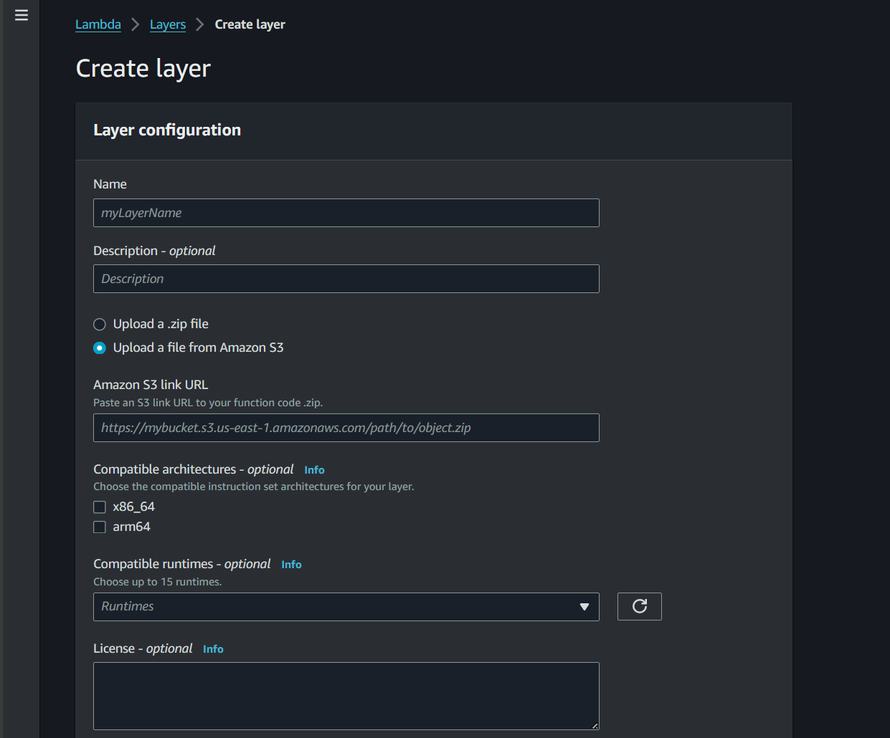
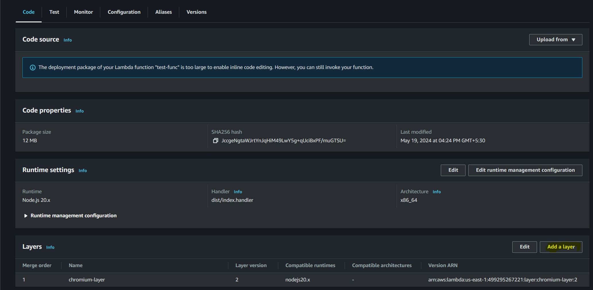
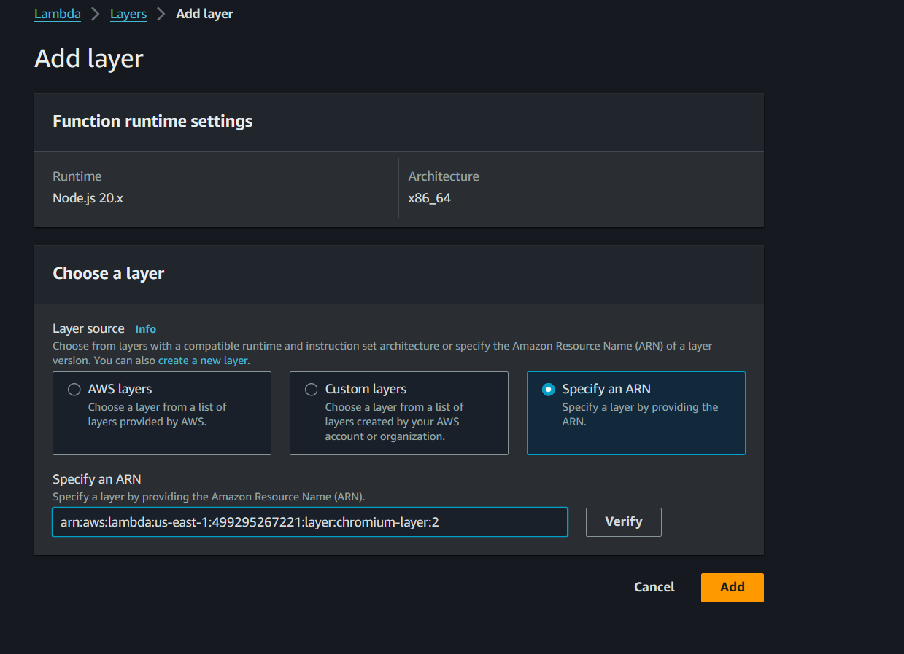

# Step To Create Lambda-layer
1. Navigate to layers folder `cd layers`
2. Run command `npm install @sparticuz/chromium@latest`
3. Create a folder with name `nodejs`
4. Cut `node_modules` folder and paste inside `nodejs` folder
5. Create a zip of `nodejs` folder
6. Upload zip to `s3` bucket
7. Create `lambda-layer`

# Step To Deploy Html-To-Pdf Lambda
1. Run command `npm install`
2. Run command `npm run build`
3. Deploy to AWS
4. Add a `Lambda Layer` to this `Lambda` 

